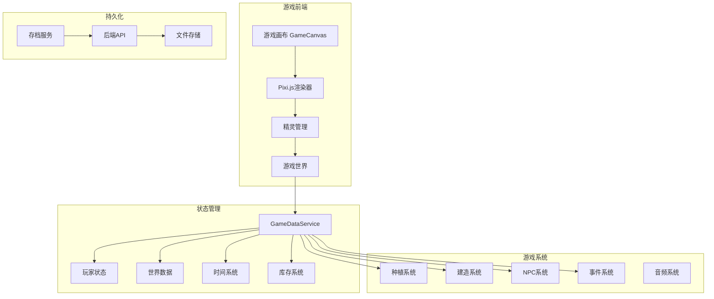

<div align="center"><a name="readme-top"></a>

# 🌾 异界神农：从零开始的悠闲田园<br/><h3>Otherworld God-Farmer: A Leisurely Garden from Scratch</h3>

一款2D像素风格的农场模拟游戏，融合种植、建造、社交等元素。<br/>
玩家扮演拥有"万能农具"神器的异世界来客，在荒地上创造理想村庄。<br/>
使用 **Emoji** 作为游戏素材，**鼠标优先** 操作，一键 **免费** 部署你的农场世界。

[在线试玩][vercel-link] · [项目文档][docs] · [问题反馈][github-issues-link] · [功能建议][github-issues-link]

<br/>

[][vercel-link]

<br/>

<!-- SHIELD GROUP -->

[![][github-release-shield]][github-release-link]
[![][vercel-shield]][vercel-link]
[![][github-license-shield]][github-license-link]<br/>
[![][github-contributors-shield]][github-contributors-link]
[![][github-forks-shield]][github-forks-link]
[![][github-stars-shield]][github-stars-link]
[![][github-issues-shield]][github-issues-link]

**分享项目**

[![][share-x-shield]][share-x-link]
[![][share-telegram-shield]][share-telegram-link]
[![][share-whatsapp-shield]][share-whatsapp-link]
[![][share-reddit-shield]][share-reddit-link]
[![][share-weibo-shield]][share-weibo-link]

<sup>🌟 开创异世界农场新纪元。为休闲游戏爱好者打造的沉浸式田园体验。</sup>

## 📸 游戏截图

<div align="center">
  
  <p><em>游戏主界面 - 农场全景视图</em></p>
</div>

<details>
<summary><kbd>📱 更多截图</kbd></summary>

<div align="center">
  
  
  <p><em>核心玩法 - 种植系统（左）和建造系统（右）</em></p>
</div>

<div align="center">
  
  
  <p><em>社交系统 - NPC互动和随机事件</em></p>
</div>

</details>

**技术栈徽章：**

<div align="center">

 
 
 
 
 
 

</div>

</div>

> [!IMPORTANT]
> 本项目展示了现代Web游戏开发实践。结合 Angular 19 与 Pixi.js 8 提供高性能2D渲染。特色包括完整的农场模拟系统、鼠标优先控制、Emoji视觉素材、实时存档系统。

<details>
<summary><kbd>📑 目录</kbd></summary>

#### 目录

- [🌟 项目介绍](#-项目介绍)
- [✨ 核心特性](#-核心特性)
  - [`1` 完整农场系统](#1-完整农场系统)
  - [`2` 建造与发展](#2-建造与发展)
  - [`3` 社交与事件](#3-社交与事件)
- [🛠️ 技术架构](#️-技术架构)
- [⚡️ 性能优化](#️-性能优化)
- [🚀 快速开始](#-快速开始)
  - [环境要求](#环境要求)
  - [安装步骤](#安装步骤)
  - [开发模式](#开发模式)
- [🎮 游戏指南](#-游戏指南)
  - [基础操作](#基础操作)
  - [游戏系统](#游戏系统)
- [🛳 部署](#-部署)
- [📖 API文档](#-api文档)
- [🤝 贡献指南](#-贡献指南)
- [📄 许可证](#-许可证)
- [👥 作者](#-作者)

####

<br/>

</details>

## 🌟 项目介绍

我们致力于创造一个充满乐趣的异世界农场模拟游戏。通过现代Web技术和创新的游戏设计，为玩家提供轻松愉快的田园生活体验。

游戏采用 **全Emoji视觉风格**，无需任何外部素材资源。支持 **鼠标优先操作**，降低上手难度。包含完整的农场经营要素：种植、收获、建造、社交、探索。

> [!NOTE]
> - Node.js >= 18.0 必需
> - 支持现代浏览器（Chrome, Firefox, Safari, Edge）
> - 推荐分辨率 1920x1080 或更高
> - 游戏自动保存进度

| [![][demo-shield-badge]][vercel-link] | 无需安装！访问在线版本立即体验游戏。 |
| :------------------------------------- | :----------------------------------- |

> [!TIP]
> **⭐ 给我们点个Star** 支持项目发展，获取最新更新通知！

[![][image-star]][github-stars-link]

<details>
  <summary><kbd>⭐ Star历史</kbd></summary>
  <picture>
    <source media="(prefers-color-scheme: dark)" srcset="https://api.star-history.com/svg?repos=ChanMeng666%2Fotherworld-god-farmer&theme=dark&type=Date">
    
  </picture>
</details>

## ✨ 核心特性

### `1` 完整农场系统

体验从荒地到繁荣农场的完整过程。我们的农业系统提供了丰富的种植选择和季节变化，让每一次收获都充满成就感。

**种植系统：**
- 🌾 **10种作物**：萝卜、土豆、胡萝卜、小麦、番茄、玉米、南瓜、草莓、卷心菜、稻米
- 🌱 **生长阶段**：种子→发芽→成长→成熟，每种作物独特生长周期
- 💧 **灌溉系统**：需要定期浇水保持土壤湿润
- 🍂 **季节系统**：春夏秋冬四季，不同作物适应不同季节

**工具系统：**
- 🌾 锄头 - 耕地
- 💧 水壶 - 浇水
- 🪓 斧头 - 砍树
- ⛏️ 镐子 - 采矿
- 🔨 锤子 - 建造
- 🎣 鱼竿 - 钓鱼

[![][back-to-top]](#readme-top)

### `2` 建造与发展

从简陋小屋到繁华村庄，建造系统让你自由规划农场布局，打造独一无二的田园世界。

**建筑类型：**
- 🏠 **小屋** - 基础居住建筑
- 🏚️ **谷仓** - 存储农作物
- ⛲ **水井** - 提供水源
- 🏪 **商店** - 买卖物品
- 🛖 **工坊** - 制作工具

**资源系统：**
- 🪵 木材 - 从树木获取
- 🪨 石材 - 从岩石开采
- 🌾 农产品 - 种植收获
- 💰 金币 - 交易货币

[![][back-to-top]](#readme-top)

### `3` 社交与事件

与5位性格各异的NPC建立友谊，体验10种随机事件带来的惊喜与挑战。

**NPC系统：**
- 👨‍🌾 **农夫老王** - 传授种植技巧
- 👩‍🏫 **老师小李** - 教授新知识
- 🧑‍🍳 **厨师大张** - 收购食材
- 👨‍💼 **商人老赵** - 买卖物品
- 👶 **小孩小明** - 活泼可爱

**随机事件：**
- 🌧️ 雨天 - 自动浇水
- ☀️ 晴天 - 作物生长加快
- 🧙 商人来访 - 稀有种子
- 🎊 丰收节 - 价格上涨
- 🏜️ 干旱 - 需要更多水
- ⛈️ 暴风雨 - 作物受损
- 🧚 精灵祝福 - 成长加速
- 🧧 春节 - 获得红包
- ☄️ 流星雨 - 幸运加成
- 🏪 集市日 - 需求增加

<div align="right">

[![][back-to-top]](#readme-top)

</div>

## 🛠️ 技术架构

<div align="center">
  <table>
    <tr>
      <td align="center" width="96">
        
        <br>Angular 19
      </td>
      <td align="center" width="96">
        
        <br>TypeScript 5
      </td>
      <td align="center" width="96">
        
        <br>Pixi.js 8
      </td>
      <td align="center" width="96">
        
        <br>Node.js 18
      </td>
      <td align="center" width="96">
        
        <br>RxJS 7
      </td>
      <td align="center" width="96">
        
        <br>Vercel
      </td>
    </tr>
  </table>
</div>

**前端技术栈：**
- **框架**: Angular 19 (Standalone Components)
- **渲染引擎**: Pixi.js 8 (WebGL 2D Graphics)
- **语言**: TypeScript 5 严格模式
- **状态管理**: RxJS + Services单例模式
- **样式**: SCSS + Tailwind CSS
- **构建工具**: Angular CLI + Webpack

**后端技术栈：**
- **运行时**: Node.js 18 LTS
- **框架**: Express.js
- **数据存储**: JSON文件系统
- **API**: RESTful架构

**游戏系统架构：**



**项目结构：**

```
src/
├── app/
│   ├── components/        # UI组件
│   │   ├── player-hud/   # HUD显示
│   │   ├── inventory/    # 背包界面
│   │   ├── tool-wheel/   # 工具轮盘
│   │   └── ...
│   ├── game/             # 游戏核心
│   │   └── game-canvas/  # 主画布
│   ├── models/           # 数据模型
│   │   ├── player.model.ts
│   │   ├── world.model.ts
│   │   └── ...
│   └── services/         # 业务服务
│       ├── game-data.service.ts
│       ├── world.service.ts
│       └── ...
└── backend/              # 后端服务
    ├── routes/          # API路由
    └── data/           # 存档数据
```

## ⚡️ 性能优化

**优化措施：**
- ⚡ **FPS监控**: 实时性能监控与调试
- 🚀 **视锥剔除**: 只渲染可见区域
- 💨 **对象池**: 复用游戏对象减少GC
- 📊 **批量渲染**: 减少Draw Call
- 🔄 **纹理缓存**: 优化Emoji纹理加载

**性能指标：**
- ✅ 稳定 **60 FPS** 运行
- ✅ 启动时间 **< 3秒**
- ✅ 内存占用 **< 200MB**
- ✅ 支持 **30x20** 地图规模

## 🚀 快速开始

### 环境要求

> [!IMPORTANT]
> 请确保已安装以下环境：

- Node.js 18.0+ ([下载](https://nodejs.org/))
- npm 或 yarn 包管理器
- Git ([下载](https://git-scm.com/))
- 现代浏览器（Chrome 90+, Firefox 88+, Safari 14+, Edge 90+）

### 安装步骤

**1. 克隆仓库**

```bash
git clone https://github.com/ChanMeng666/otherworld-god-farmer.git
cd otherworld-god-farmer
```

**2. 安装依赖**

```bash
# 安装前端依赖
npm install

# 安装后端依赖
cd backend
npm install
cd ..
```

**3. 启动开发服务器**

```bash
# 启动前端 (新终端)
npm start
# 前端运行在 http://localhost:4201

# 启动后端 (新终端)
cd backend
npm start
# 后端运行在 http://localhost:3000
```

🎉 **成功！** 打开 [http://localhost:4201](http://localhost:4201) 开始游戏。

### 开发模式

```bash
# 开发命令
npm start          # 启动前端开发服务器
npm run build      # 构建生产版本
npm run test       # 运行测试
npm run lint       # 代码检查

# 后端命令
cd backend
npm start          # 启动后端服务
npm run dev        # 开发模式（热重载）
```

## 🎮 游戏指南

### 基础操作

**移动控制：**
- 🎮 **WASD键** - 角色移动
- 🖱️ **鼠标点击** - 点击移动到目标位置
- 🖱️ **右键菜单** - 显示可用操作

**工具使用：**
- 🔧 **自动选择** - 根据目标自动切换工具
- 🖱️ **左键使用** - 使用当前工具
- ⚙️ **工具轮盘** - 手动选择工具

**界面操作：**
- 📦 **背包按钮** - 打开/关闭背包
- 🏗️ **建造按钮** - 打开建造菜单
- 💾 **存档按钮** - 保存/加载游戏
- ❓ **帮助按钮** - 查看操作指南

### 游戏系统

**种植流程：**
1. 使用锄头耕地
2. 选择种子种植
3. 定期浇水
4. 等待成熟
5. 收获作物

**建造流程：**
1. 收集资源（木材、石材）
2. 打开建造菜单
3. 选择建筑类型
4. 放置建筑

**NPC互动：**
- 右键点击NPC对话
- 赠送礼物提升好感度
- 完成任务获得奖励

## 🛳 部署

### Vercel部署（推荐）

[](https://vercel.com/new/clone?repository-url=https%3A%2F%2Fgithub.com%2FChanMeng666%2Fotherworld-god-farmer)

### 手动部署

```bash
# 构建生产版本
npm run build

# 部署dist目录到任何静态托管服务
```

## 📖 API文档

**存档系统API：**

| 方法 | 端点 | 描述 | 认证 |
|------|------|------|------|
| `POST` | `/api/save` | 保存游戏 | ❌ |
| `GET` | `/api/load/:userId` | 加载存档 | ❌ |
| `GET` | `/api/saves/:userId` | 获取存档列表 | ❌ |
| `DELETE` | `/api/save/:saveId` | 删除存档 | ❌ |

**示例请求：**

```javascript
// 保存游戏
fetch('http://localhost:3000/api/save', {
  method: 'POST',
  headers: { 'Content-Type': 'application/json' },
  body: JSON.stringify({
    userId: 'player123',
    saveData: gameState
  })
});
```

## 🤝 贡献指南

欢迎贡献代码！请遵循以下流程：

1. Fork本仓库
2. 创建功能分支 (`git checkout -b feature/AmazingFeature`)
3. 提交更改 (`git commit -m 'Add some AmazingFeature'`)
4. 推送到分支 (`git push origin feature/AmazingFeature`)
5. 提交Pull Request

**代码规范：**
- 使用TypeScript严格模式
- 遵循Angular风格指南
- 添加必要的注释
- 确保测试通过

## 📄 许可证

本项目采用 MIT 许可证 - 查看 [LICENSE](LICENSE) 文件了解详情。

## 👥 作者

<div align="center">
  <table>
    <tr>
      <td align="center">
        <a href="https://github.com/ChanMeng666">
          
          <br />
          <sub><b>Chan Meng</b></sub>
        </a>
        <br />
        <small>创作者 & 主要开发者</small>
      </td>
    </tr>
  </table>
</div>

**联系方式：**
- 💼 LinkedIn: [chanmeng666](https://www.linkedin.com/in/chanmeng666/)
- 🐙 GitHub: [@ChanMeng666](https://github.com/ChanMeng666)
- 📧 Email: [chanmeng.dev@gmail.com](mailto:chanmeng.dev@gmail.com)
- 🌐 Portfolio: [chanmeng.live](https://chanmeng.live)

---

<div align="center">
<strong>🚀 打造异世界最棒的农场游戏 🌟</strong>
<br/>
<em>让每个玩家都能享受田园生活的乐趣</em>
<br/><br/>

⭐ **Star本项目** • 🐛 **报告问题** • 💡 **功能建议** • 🤝 **贡献代码**

<br/>

**用 ❤️ 由 Chan Meng 制作**


</div>

---

<!-- LINK DEFINITIONS -->

[back-to-top]: https://img.shields.io/badge/-回到顶部-151515?style=flat-square

<!-- Project Links -->
[vercel-link]: https://otherworld-god-farmer.vercel.app/
[docs]: https://github.com/ChanMeng666/otherworld-god-farmer#readme
[demo-link]: https://otherworld-god-farmer.vercel.app/

<!-- GitHub Links -->
[github-issues-link]: https://github.com/ChanMeng666/otherworld-god-farmer/issues
[github-stars-link]: https://github.com/ChanMeng666/otherworld-god-farmer/stargazers
[github-forks-link]: https://github.com/ChanMeng666/otherworld-god-farmer/forks
[github-contributors-link]: https://github.com/ChanMeng666/otherworld-god-farmer/contributors
[github-release-link]: https://github.com/ChanMeng666/otherworld-god-farmer/releases
[github-license-link]: https://github.com/ChanMeng666/otherworld-god-farmer/blob/main/LICENSE

<!-- Shield Badges -->
[github-release-shield]: https://img.shields.io/github/v/release/ChanMeng666/otherworld-god-farmer?color=369eff&labelColor=black&logo=github&style=flat-square
[vercel-shield]: https://img.shields.io/badge/vercel-在线-55b467?labelColor=black&logo=vercel&style=flat-square
[github-contributors-shield]: https://img.shields.io/github/contributors/ChanMeng666/otherworld-god-farmer?color=c4f042&labelColor=black&style=flat-square
[github-forks-shield]: https://img.shields.io/github/forks/ChanMeng666/otherworld-god-farmer?color=8ae8ff&labelColor=black&style=flat-square
[github-stars-shield]: https://img.shields.io/github/stars/ChanMeng666/otherworld-god-farmer?color=ffcb47&labelColor=black&style=flat-square
[github-issues-shield]: https://img.shields.io/github/issues/ChanMeng666/otherworld-god-farmer?color=ff80eb&labelColor=black&style=flat-square
[github-license-shield]: https://img.shields.io/badge/license-MIT-white?labelColor=black&style=flat-square

[demo-shield-badge]: https://img.shields.io/badge/在线试玩-ONLINE-55b467?labelColor=black&logo=vercel&style=for-the-badge

<!-- Social Share Links -->
[share-x-link]: https://x.com/intent/tweet?hashtags=游戏开发&text=发现了一个有趣的农场游戏项目&url=https%3A%2F%2Fgithub.com%2FChanMeng666%2Fotherworld-god-farmer
[share-telegram-link]: https://t.me/share/url?text=异界神农：一个有趣的农场模拟游戏&url=https%3A%2F%2Fgithub.com%2FChanMeng666%2Fotherworld-god-farmer
[share-whatsapp-link]: https://api.whatsapp.com/send?text=看看这个农场游戏项目%20https%3A%2F%2Fgithub.com%2FChanMeng666%2Fotherworld-god-farmer
[share-reddit-link]: https://www.reddit.com/submit?title=Otherworld%20God-Farmer%20-%20农场模拟游戏&url=https%3A%2F%2Fgithub.com%2FChanMeng666%2Fotherworld-god-farmer
[share-weibo-link]: http://service.weibo.com/share/share.php?title=异界神农：从零开始的悠闲田园&url=https%3A%2F%2Fgithub.com%2FChanMeng666%2Fotherworld-god-farmer

[share-x-shield]: https://img.shields.io/badge/-分享到%20X-black?labelColor=black&logo=x&logoColor=white&style=flat-square
[share-telegram-shield]: https://img.shields.io/badge/-分享到%20Telegram-black?labelColor=black&logo=telegram&logoColor=white&style=flat-square
[share-whatsapp-shield]: https://img.shields.io/badge/-分享到%20WhatsApp-black?labelColor=black&logo=whatsapp&logoColor=white&style=flat-square
[share-reddit-shield]: https://img.shields.io/badge/-分享到%20Reddit-black?labelColor=black&logo=reddit&logoColor=white&style=flat-square
[share-weibo-shield]: https://img.shields.io/badge/-分享到%20微博-black?labelColor=black&logo=sinaweibo&logoColor=white&style=flat-square

<!-- Images -->
[image-star]: https://img.shields.io/github/stars/ChanMeng666/otherworld-god-farmer?style=social